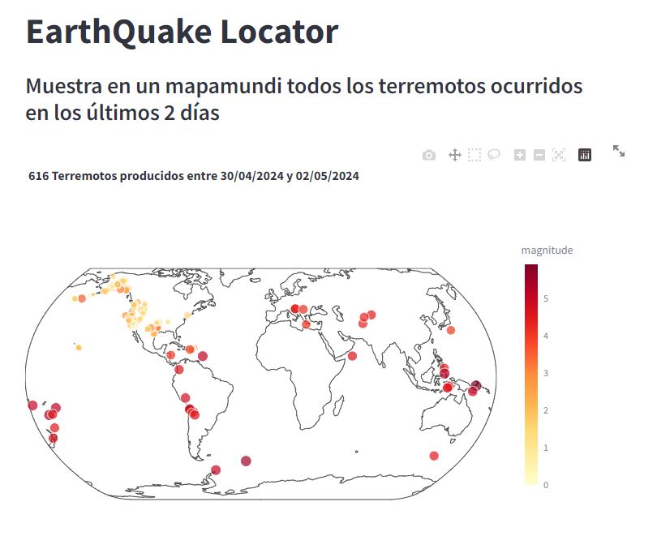

# EarthQuakeLocator
### v0.1.0

## Descripción
Pequeña aplicación para mostrar todos los terremotos del planeta en un lapso de 2 días desde la fecha actual.

Datos extraidos de la API de [USGS](https://earthquake.usgs.gov/fdsnws/event/1/)

## Construido Con
- plotly express
- streamlit

## Licencia
Copyright 2024 Sergio Tejedor Moreno

Licensed under the Apache License, Version 2.0 (the "License");
you may not use this file except in compliance with the License.
You may obtain a copy of the License at

    http://www.apache.org/licenses/LICENSE-2.0

Unless required by applicable law or agreed to in writing, software
distributed under the License is distributed on an "AS IS" BASIS,
WITHOUT WARRANTIES OR CONDITIONS OF ANY KIND, either express or implied.
See the License for the specific language governing permissions and
limitations under the License.
